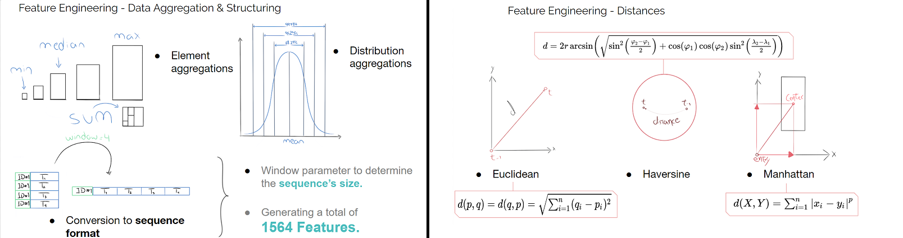

# EY NEXTWAVE DATA SCIENCE COMPETITION 2019 - WINNING PROJECT

A work by
<table>
<tr>
<td align="center">
<a href="https://www.linkedin.com/in/victor-oliveira-b0634449/"> 
<b>Victor Oliveira</b></a> 
<a href="https://github.com/jcezarms/ey-geolock/tree/master/references" title="Research">📑</a> <a href="https://github.com/jcezarms/ey-geolock/commits?author=vtoliveira" title="Code">💻</a> <a href="https://github.com/jcezarms/ey-geolock/commits?author=vtoliveira" title="Documentation">📖</a></td>
<td align="center">
<a href="https://www.linkedin.com/in/julio-cms/"> 
<b>Julio Cezar Silva</b></a> 
<a href="https://github.com/jcezarms/ey-geolock/tree/master/references" title="Research">📑</a> <a href="https://github.com/jcezarms/ey-geolock/commits?author=jcezarms" title="Code">💻</a> <a href="https://github.com/jcezarms/ey-geolock/commits?author=jcezarms" title="Documentation">📖</a></td>
</tr>
</table>

This is our winning submission for EY NextWave Data Science Competition. Our win was decided upon the combination of our final score and [this presentation](LINK). The target of this competition consisted on predicting if a trajectory sequence would end up inside Atlanta's city center around 15:00-16:00 using geolocation data.

Our winning F1-score and model ranking:

| Leaderboard | Score | Brazilian Ranking | Global Ranking |
|      :---:      |      :---:      |     :---:      |     :---:      |
| Private | 0.89401  | 2nd | 23th |
| Public | 0.8853  | 3rd | 31th |

> On the finals in Brazil, we presented our work and were selected as winners for creating a project focused not only on F1-score optimization but also on soft skills, a problem oriented Machine Learning approach and thorough research on the field.

# Strategy
We focused on agglomerating a robust amount of research-based features - based on sequence data format and geometrical insights. For a full rundown of all our features, you can either refer to [our final submission notebook](./notebooks/08_final_submission.ipynb) or [watch the presentation](LINK), but here are some of the most prominent feature examples:

We managed to work with all features enabled by our insights and research - from agglomerating every feature possible in every way allowed by `pandas`, to [using external data](LINK) like road and traffic information.

# Guidelines
## EY NextWave Data Science Competition 2019

In this document we will give orientations and discuss each component our final submission is made of. The complete work is spread throughout several notebooks, each belonging to a certain execution order. A purpose summary and description will also be given over every notebook present.

## Notebooks

### Exploratory Data Analysis

[🔗 Study the notebook](./notebooks/01_extensive_exploratory_data_analysis.ipynb)

For the EDA notebook we worked on visualizations, simple statistics, and map plots. The purpose was to better understand how data was distributed within both train and test datasets, and how the main features related to each other and regarding the time component. We searched for outliers, patterns, and inconsistencies with our data so we could take a better decision on how to approach the feature engineering and preprocessing phase.

### Clustering

[🔗 Study the notebook](./notebooks/02_clustering.ipynb)

Here we used unsupervised techniques such as KMeans and DBSCAN to explore the spatial component of the dataset. Thus, we were able to identify patterns and clusters around city and most visited points. It also contains plots showing how the trajectories are segmented around the city.

### Residual Analysis

[🔗 Study the notebook](./notebooks/03_residual_learning.ipynb)

This chapter relates to an analysis of all predictions gotten wrong by the model early on. By analysing patterns particular to this group of data points, the main goal of our residual analysis is to come up with reasonable insights and optimizations backed by scientific conclusions. Geographic plots are performed over combinations of four main data groups: correctly predicted, wrongly predicted, longest and shortest trajectories.
 
### LSTM

[🔗 Study the notebook](./notebooks/04_lstm.ipynb)

We also implemented a Deep Learning approach based on Long-Short Term Memory networks, taking into account the sequential aspect of data in order to make predictions. This particular architecture is here coded using the pytorch framework, truncating the data into five temporal sequences.

### Stacking Models

[🔗 Study the notebook](./notebooks/05_stacking_ensembling_voting_techniques.ipynb)

The fourth item comprises the most efficient model stacking strategies taken upon our best-fitting architectures. From a general scope, stacked algorithms in the present section include: Logistic Regression, Random Forest, kNN, and Gradient Boosting. Different stacking strategies are presented, which expectedly culminated in a significant prediction score increase.

### Training Models and Hyperparameter Tuning

[🔗 Study the notebook](./notebooks/06_training_classification_models.ipynb)

A volume of work focused on directly instantiating and training our models is undertaken in this section. Different configurations, both the empirically made and the ones calculated through the likes of GridSearch, are seen throughout the related notebook.

### Exploring External Data

[🔗 Study the notebook](./notebooks/07_exploring_external_data.ipynb)

We also explored external data sources taken from Georgia Department of Transportation’s (GDOT) Office of Transportation Data (OTD) that collects traffic data to meet the needs of Georgia’s federally required traffic monitoring program. Here, we got traffic reports over all Georgia state about traffic conditions with features such as:  ADDT (Annual average daily traffic), K-Factor (proportion of annual average daily traffic occurring in an hour), COUNTY (representing the county), ROADID (Integer indicating the road which reports regards to), and many others. We were able to join the original dataset with this one by Lat/Long positions - in this way we have information that estimates local traffic conditions.
 
### Feature Engineering and Final Submission

[🔗 Study the notebook](./notebooks/08_final_submission.ipynb)

The concluding body of work that englobes a documented trajectory directed towards a final model. Every feature section within this notebook contains at least an introduction paragraph describing a motivation and reasoning for the calculations. This contains not only a trajectory throughout the (judged to be) most reasonable features, structures and aggregations, but also the execution of a final most performatic model architecture - LightGBM.

## Utilities

A brief introduction of the utility files present in the project.

### File: [utils.py](./src/utils.py)

In order to achieve a higher level of modularization, we decided to isolate specific code blocks from the many notebooks described above. It is clear that, throughout the several notebooks in this project’s setup, with demands such as those of plotting, processing and other necessarily repetitive tasks, there comes the need to redirect reusable code to a centralized resource - here, this is our utils script. Aside from that, it also serves as a readability asset, taking some overly complex code blocks out of the way of storytelling cycles - which also gave us space to organize and document those complex blocks without boundaries for e.g. docstring length.

### File: [lstm.py](./src/lstm.py)

Much in the same motivation attended by the utils script, lstm.py centralizes the LSTM module class and instantiation, as well as training, validation and scoring functions, in an isolated and clear manner. This takes a considerable piece of code out of the LSTM notebook’s analysis flow and improves the overall maintainability.
